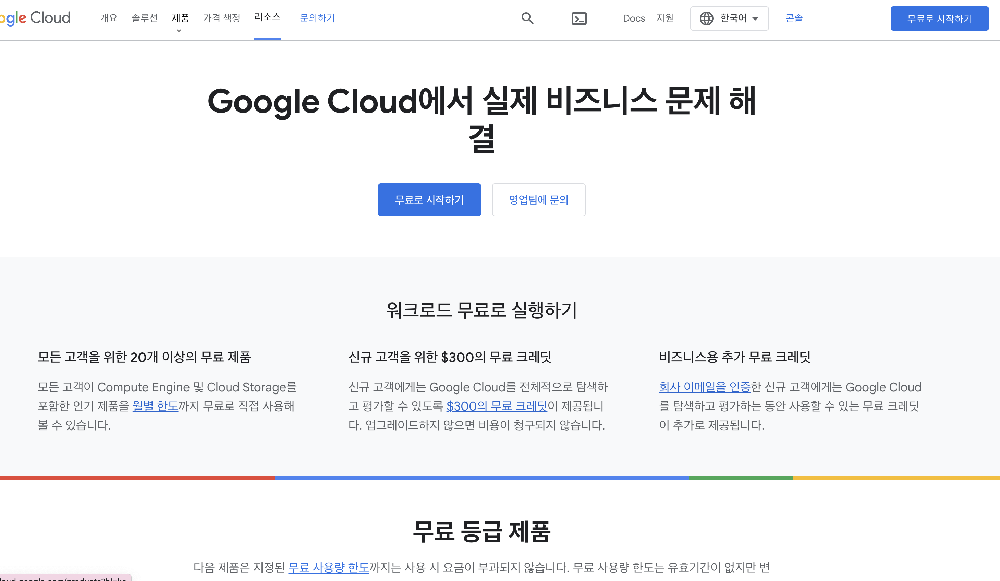

## GCP Kubernetes 생성하기 (무료 Creatdit 사용)

### 1. Google.com 에서 GCP 라고 입력 후 검색 후 무료 등록을 클릭한다.
    
> 

### 2. 무료로 시작 하기 클릭.

> 

### 3. 결제 정보를 입력해주세요. 만약 입력하지 않을 경우 서비스 사용이 제한됩니다.

> 

### 4. 입력 완료 후 왼쪽 상단의 메뉴바 클릭 하면 아래와 같은 스크린샷이 나옵니다.

> 

### 5. 클러스터 생성 클릭 하면 아래와 같은 화면이 나옵니다. 
    
> 

### 6. 일단 Default 로 만들기 때문에 쭉쭉 다음을 눌러주세요.

> 

### 7. 약 7분 ~ 10분 정도 소요된 후 생성이 완료됩니다.

> 

# Local Kubernetes 설치 하는 법

- https://kubernetes.io/ko/docs/tasks/tools/install-kubectl-macos/

# GCP Kubernetes Local 연동 하는법

- https://cloud.google.com/sdk/docs/install?hl=ko 

### Mac GCP CLI를 설치하는 법
- GCP CLI의 gcloud를 사용하기 위해서는 Cloud SDK 필요함으로 아래 링크로 접속하여 설치한다.

- [링크 참조](https://cloud.google.com/sdk/docs/install-sdk?hl=ko#macos)  

  1. 위의 링크에 들어가서 자기 플랫폼에 맞는 SDK 압축 파일을 받고 압축 해제를 한다

  2. 압축해제 한 위치에서 또는 옮긴 위치에서 쉘 스크립트를 실행핸다. (설치 스크립트)
        ```
        ./google-cloud-sdk/install.sh
        ```

  3. 설치가 된 후 초기화를 진행한다.
   
        ```
        ./google-cloud-sdk/bin/gcloud init
        ```

  4. 마지막으로 클러스터 생성한 목록에서 '연결' 선택 후 명령어를 콘솔에 입력하여 연결합니다. 


        

        

        


### Window GCP CLI를 설치하는 법

- [링크 참조](https://cloud.google.com/sdk/docs/install-sdk?hl=ko#windows)

### Linux GCP CLI를 설치하는 법

- [링크 참조](https://cloud.google.com/sdk/docs/install-sdk?hl=ko#linux)


## 잘 설치 되었는지 확인하는 방법

- 로컬 Terminal 창에서 ``` kubectl api-resources  ``` 명령어 호출 아래와 같이 뜨면 됩니다. 
  
  <br/>

## local gcp 연동 시 트러블 슈팅 

  - Q1 로컬 Terminal 창에서 `클러스터 연결에 있는 명령어` 를 쳤는데 아래와 같은 에러가 나요.
  
      ```
      CRITICAL: ACTION REQUIRED: gke-gcloud-auth-plugin, which is needed for continued use of kubectl, was not found or is not executable. 
      
      Install gke-gcloud-auth-plugin for use with kubectl by following https://cloud.google.com/blog/products/containers-kubernetes/kubectl-auth-changes-in-gke
      ```

  - A1 
      
      ```
      이 오류 메시지는 gke-gcloud-auth-plugin이 누락되었거나 실행할 수 없음을 나타내며 Google Kubernetes Engine(GKE)에서 kubectl을 사용하는 데 필요합니다.

      이 문제를 해결하려면 다음 단계를 따르세요.

      1. 머신에 최신 버전의 Google Cloud SDK가 설치되어 있는지 확인하세요.
      터미널 또는 명령 프롬프트를 열고 명령을 실행하여 gcloud components install kubectlkubectl 명령줄 도구를 설치합니다.

      2. 명령어를 실행하여 gcloud auth loginGoogle Cloud 계정으로 인증하고 필요한 권한을 부여합니다.

      3. 명령어를 실행하여 gcloud container clusters get-credentials <cluster-name>GKE 클러스터로 인증하고 클러스터에 액세스하는 데 필요한 사용자 인증 정보를 다운로드합니다.

      4. 마지막으로 명령어를 실행하여 kubectl config use-context <context-name>현재 컨텍스트를 GKE 클러스터 컨텍스트로 설정하면 kubectl을 사용하여 클러스터의 리소스를 관리할 수 있습니다.

      gke-gcloud-auth-plugin 관련 문제가 계속 발생하면 명령을 실행하여 gcloud components updateGoogle Cloud SDK의 모든 구성요소를 최신 버전으로 업데이트할 수 있습니다. 
      
      또한 SDK를 처음부터 다시 설치하여 모든 구성 요소가 제대로 설치되고 구성되었는지 확인할 수 있습니다.
      ```

```toc

```