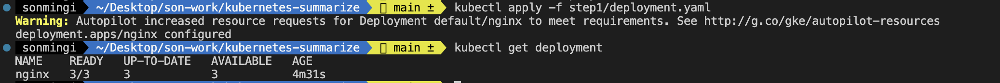
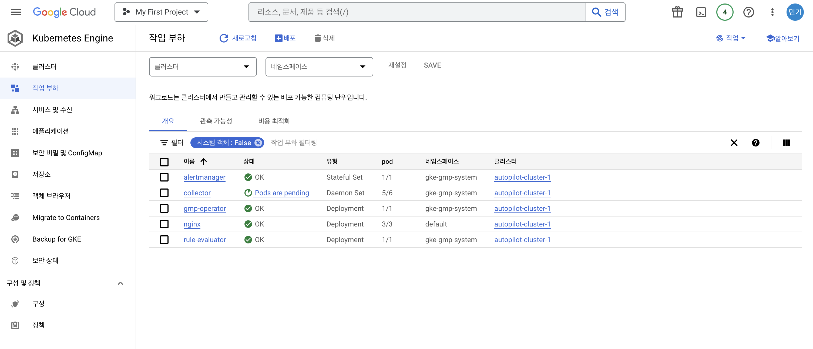
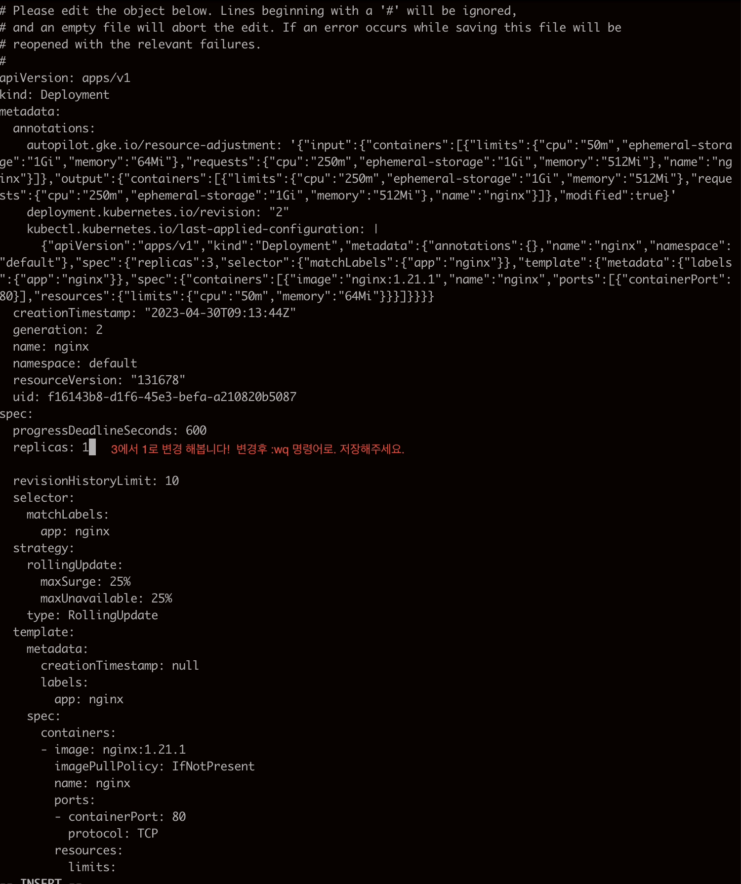
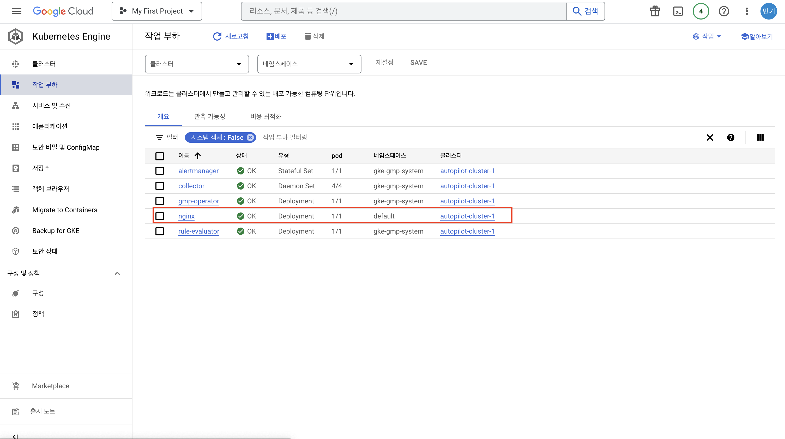

## 🔖 서론
> 만드는법은 이전글을 참고 해주세요.
>
> 이번에는 간단하게 쿠버네티스 실습 하려고합니다.
> - https://github.com/smk692/kubernetes-summarize
>
> 코드는 위의 링크에 있으며 간단한 실습 내용이라 안되는 부분은 댓글로 부탁드리겠습니다.

## 🖋️ 실습 GCP Kubernetes Engine Pod 생성 및 수정

### 시작 전 테스트 ```kubectl get pod``` 명령어 시 에러가 날 경우 이전 블로그 글을 확인해주세요.

### 1. git clone 을 진행해주세요.
 
      git clone https://github.com/smk692/kubernetes-summarize.git

준비물: deployment.yaml 

      apiVersion: apps/v1
      kind: Deployment
      metadata:
      name: nginx
      spec:
      selector:
      matchLabels:
            app: nginx
      replicas: 3
      template:
      metadata:
            labels:
            app: nginx
      spec:
            containers:
            - name: nginx
            image: nginx:1.21.1
            ports:
            - containerPort: 80
            resources:
            limits:
                  memory: "64Mi"
                  cpu: "50m"

### 2. 디렉토리 위치 변경 

```sh
cd kubernetes-summarize/step1
```
      
### 3. pod 생성
```sh
kubectl apply -f deployment.yaml

kubectl get deployment
```


<br/>

**GCP Kubernetes Engine 잘 생성된걸 확인 할 수 있습니다.**



스크린샷과 같이 뜨면 Pod 생성이 완료!

### 4. pod 변경
```sh
kubectl get deployment

NAME    READY   UP-TO-DATE   AVAILABLE   AGE
nginx   3/3     3            3           6m33s

```
위에서 확인한 Name 으로 변경을 진행합니다.

```sh
kubectl edit deployment nginx
```


저장 시 ```deployment.apps/nginx edited``` 수정이되었다고 호출됩니다.



스크린샷과 같이 뜨면 Pod 변경이 완료!

---

### 5. pod 삭제

```sh
kubectl get pod

NAME                     READY   STATUS    RESTARTS   AGE
nginx-57858cd857-c8j25   1/1     Running   0          46m

kubectl delete pod nginx-57858cd857-c8j25

pod "nginx-57858cd857-c8j25" deleted # 실행되면서 삭제 된다.

kubectl get pod # 다시 확인하면 아래와 같이 새로 뜹니다.

NAME                     READY   STATUS              RESTARTS   AGE
nginx-57858cd857-mj5vz   0/1     ContainerCreating   0          2s
```

> **yaml 에서 이미 replicas 지정했기 때문에 삭제되어도 새로운 pod 가 뜨는걸 확인 할 수 있습니다.**

<br/>

## 🖊️ 실습 GCP Kubernetes Engine port-forward 테스트

> 포트포워딩은 기본적으로 실무에서는 많이 사용되지는 않고 개발에서 테스트용으로 많이 사용합니다. 

      # pod 조회
      kubectl get pod 
      
      NAME                     READY   STATUS    RESTARTS   AGE 
      nginx-57858cd857-c8j25   1/1     Running   0          16m


      kubectl port-forward nginx-57858cd857-c8j25 8080:80


위에는 냅두고 이제 다른 터미널으로 아래와 같은 명령어를 날리면 잘 조회 되는것을 알 수 있다.

```sh
curl localhost:8080/version

<html>
<head><title>404 Not Found</title></head>
<body>
<center><h1>404 Not Found</h1></center>
<hr><center>nginx/1.21.1</center>
</body>
</html>
```

# 📚 Kubernetes 로그 보는 방법

```sh
# 실행중인 포드를 접근하여 실시간 로그 확인 
kubectl attach deployment/nginx -c nginx

# 실행중인 포드를 접근하여 전체 및 실시간 로그 확인 
kubectl logs deployment/nginx -c nginx -f
```


```toc

```