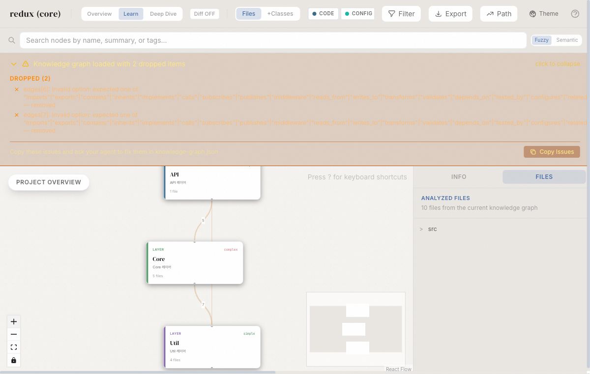
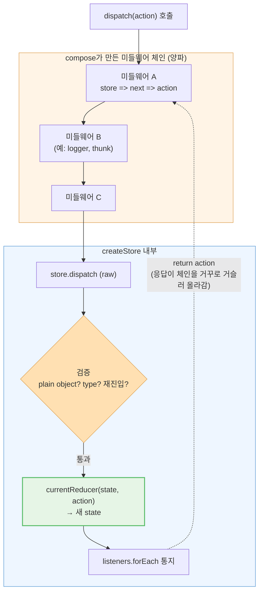

[지난 글](/understand-anything)에서 **Understand-Anything**으로 코드베이스를 지식 그래프로 만드는 걸 소개했다. 그런데 한 가지 짚고 넘어갈 게 있다.

> **"모듈 의존성 그래프? 그건 그냥 디렉토리 열면 보이잖아."**

맞는 말이다. 폴더 구조와 import 관계는 `ls`와 `package.json`만 봐도 대충 안다. 그래서 이번엔 도구의 **진짜 값어치**, 즉 "이 코드가 *실제로 무슨 일을 하는가*"를 끌어내는 데 집중했다. 대상은 모두가 아는 **Redux 코어**다.

## 디렉토리 뷰 vs 로직 뷰

Redux 코어(`src/`)는 17개 파일, 핵심은 10개 남짓이다. 디렉토리를 열면 이렇게 보인다.

```
src/
├── createStore.ts
├── applyMiddleware.ts
├── compose.ts
├── combineReducers.ts
├── bindActionCreators.ts
└── utils/ (isPlainObject, kindOf, actionTypes ...)
```

여기서 알 수 있는 건 **"파일이 있다"** 는 것뿐이다. `applyMiddleware`가 `compose`를 쓴다는 것까지는 import로 보이지만 — **"미들웨어가 대체 어떻게 dispatch를 가로채는가"** 는 0% 안 보인다. 그게 로직이다.

`/understand`로 분석하면 각 노드에 **plain-English 요약**과 관계가 붙는다. 예를 들어 `compose.ts` 노드를 누르면 이런 설명이 나온다.

> "함수 우→좌 합성. `reduce`로 `(...a) => f(g(h(...a)))` 생성 — 미들웨어 onion의 핵심"



파일 이름이 아니라 **역할과 관계**(`composes`, `wraps`, `validates`)가 붙는다는 게 핵심이다. 이제 가장 어려운 부분을 풀어보자.

## 질문: "미들웨어는 어떻게 dispatch를 가로채는가?"

`/understand-chat`에 이렇게 물었을 때 도구가 짚어주는 흐름을, 실제 코드와 함께 따라가 보자. 단 세 파일이 협업한다.

### 1. `createStore` — 가장 안쪽의 raw dispatch

```typescript
function dispatch(action: A) {
  if (!isPlainObject(action)) throw new Error(/* 순수 객체 아님 */)
  if (typeof action.type === 'undefined') throw new Error(/* type 없음 */)
  if (isDispatching) throw new Error('Reducers may not dispatch actions.')

  try {
    isDispatching = true
    currentState = currentReducer(currentState, action)  // ← 상태 갱신의 전부
  } finally {
    isDispatching = false
  }

  listeners.forEach(listener => listener())  // 구독자 통지
  return action
}
```

비자명한 포인트가 둘 있다.

- **재진입 가드**(`isDispatching`): 리듀서 실행 중에 또 `dispatch`가 불리면 던진다. "리듀서는 순수해야 한다"는 원칙을 **런타임에서 강제**하는 장치다. 파일 이름엔 안 적혀 있다.
- 상태 갱신은 결국 `currentReducer(state, action)` **한 줄**이다. 나머지는 전부 방어 코드와 통지.

### 2. `compose` — 미들웨어 onion의 정체

```typescript
export default function compose(...funcs: Function[]) {
  if (funcs.length === 0) return <T>(arg: T) => arg
  if (funcs.length === 1) return funcs[0]
  return funcs.reduce((a, b) => (...args: any) => a(b(...args)))
}
```

단 한 줄의 `reduce`가 `compose(f, g, h)`를 `(...args) => f(g(h(...args)))`로 만든다. 이게 미들웨어를 **양파 껍질처럼 감싸는** 바로 그 메커니즘이다. `compose.ts`라는 파일명에서 이걸 떠올릴 수 있는 사람은 없다.

### 3. `applyMiddleware` — dispatch를 통째로 갈아끼운다

```typescript
return createStore => (reducer, preloadedState) => {
  const store = createStore(reducer, preloadedState)
  let dispatch: Dispatch = () => { throw new Error(/* 구성 중 dispatch 금지 */) }

  const middlewareAPI = {
    getState: store.getState,
    dispatch: (action, ...args) => dispatch(action, ...args)  // ← 클로저 참조
  }
  const chain = middlewares.map(mw => mw(middlewareAPI))
  dispatch = compose(...chain)(store.dispatch)  // ← 핵심 한 줄

  return { ...store, dispatch }  // 원래 dispatch를 덮어쓴 새 store
}
```

여기 **가장 미묘한 트릭**이 있다. `middlewareAPI.dispatch`는 `store.dispatch`(raw)가 아니라 **클로저로 `dispatch` 변수를 가리킨다.** 그리고 그 변수는 바로 다음 줄에서 `compose(...chain)(store.dispatch)`로 **재할당**된다.

즉, 미들웨어 안에서 `dispatch(action)`을 호출하면 raw dispatch가 아니라 **체인 맨 앞부터 다시 통과**한다. 이 한 끗이 `redux-thunk` 같은 게 동작하는 이유다. 이건 코드를 **줄 단위로 정확히 읽어야** 보이는 로직이다.

## 전체 흐름 — dispatch가 양파를 통과하는 길

세 파일을 합치면 `dispatch(action)` 한 번이 이렇게 흐른다.



액션은 **미들웨어 A→B→C를 거쳐 raw dispatch로** 들어가고, 리턴값은 **거꾸로 C→B→A로 빠져나온다.** 양파의 안쪽으로 들어갔다 나오는 구조. 이 그림과 "재진입 가드", "클로저 dispatch 재할당" 같은 통찰은 **디렉토리·import 그래프 어디에도 없다.** 오직 코드를 읽어야 나온다.

## 더 깊이 — 정적 분석을 넘어 "실행으로 증명"

여기까지는 코드를 **읽어서 추론**한 것이다. 진짜 깊이는 한 단계 더 간다 — **직접 돌려서 맞는지 확인**하는 것이다. Redux를 설치하고(`redux@5.0.1`), 진입/복귀를 로깅하는 미들웨어 3개(A·B·C)를 끼워 실제로 `dispatch`해봤다.

```javascript
const trace = (name) => (store) => (next) => (action) => {
  if (typeof action === 'function') {          // thunk
    return action(store.dispatch, store.getState)
  }
  console.log(`[${name}] ▶ 진입`)
  const result = next(action)                  // 다음 껍질로
  console.log(`[${name}] ◀ 복귀`)
  return result
}
const store = createStore(reducer, applyMiddleware(trace('A'), trace('B'), trace('C')))
```

### 증거 1 — 양파는 정말 양파였다

```
store.dispatch({ type: 'INC' })

[A] ▶ 진입 (action=INC)
[B] ▶ 진입 (action=INC)
[C] ▶ 진입 (action=INC)
[C] ◀ 복귀 (state.n=1)   ← 리듀서 실행 후
[B] ◀ 복귀 (state.n=1)
[A] ◀ 복귀 (state.n=1)
```

`A→B→C`로 들어가서 `C→B→A`로 나온다. 앞서 그린 mermaid 그림이 **추측이 아니라 사실**임이 확인된다.

### 증거 2 — thunk가 동작하는 진짜 이유

가장 미묘했던 "클로저 dispatch 재할당" 트릭. thunk를 던져봤다.

```
store.dispatch((dispatch, getState) => {
  dispatch({ type: 'INC' })   // 안에서 다시 dispatch
})

[A] action이 함수 → thunk 실행
   thunk 내부: 현재 n=1, 다시 dispatch(INC) 호출
[A] ▶ 진입 (action=INC)   ← raw dispatch가 아니라
[B] ▶ 진입 (action=INC)   ← 체인 맨 앞부터
[C] ▶ 진입 (action=INC)   ← 다시 통과!
[C] ◀ 복귀 (state.n=2)
[B] ◀ 복귀 (state.n=2)
[A] ◀ 복귀 (state.n=2)
```

thunk 내부의 `dispatch`가 **raw dispatch로 직행하지 않고 A부터 다시 양파를 통과**한다. `applyMiddleware`의 `middlewareAPI.dispatch`가 클로저로 재할당된 변수를 가리키기 때문 — 코드로 읽었던 그 한 끗이 실행으로 증명됐다.

### 증거 3 — 재진입 가드는 실제로 막는다

```
// 리듀서 안에서 dispatch 시도
throw: Reducers may not dispatch actions.
```

`isDispatching` 플래그가 진짜로 던진다. "리듀서는 순수해야 한다"가 문서상 권고가 아니라 **런타임 강제**임을 눈으로 확인.

> **이게 "딥하게 들어간다"의 의미다.** 도구의 요약(이게 뭐 하는 코드인지) → 코드 정독(어떻게 하는지) → 실행 검증(정말 그런지). Understand-Anything은 1·2단계를 가속하고, 3단계의 "어디를 실행해봐야 하는지"를 좁혀준다.

## 그래서 도구가 주는 건

같은 분석을 사람이 직접 하려면 파일 3개를 열어 타입 시그니처와 클로저를 추적해야 한다. Understand-Anything의 가치는 이 과정을 대신해서:

- **노드별 plain-English 요약** — "이 파일이 무슨 일을 하는지" 한 줄로
- **로직 관계 엣지** — 단순 import가 아니라 `composes` / `wraps` / `validates` 같은 *의미 있는 관계*
- `/understand-chat` — "미들웨어는 어떻게 동작해?" 같은 질문에 **호출 흐름으로 답**
- `/understand-explain <file>` — 특정 파일을 줄 단위 의도까지 풀어 설명

즉, 모듈 그래프(디렉토리 수준)는 **시작점**일 뿐이고, 진짜는 그 위에 얹히는 **로직 수준 이해**다.

## 한계도 분명하다

- LLM이 코드를 "읽고 요약"하는 단계라 **파일 수에 비례해 비용**이 든다. 큰 레포는 **궁금한 모듈만 스코프를 좁혀** 돌리는 게 맞다.
- 요약은 어디까지나 **출발점**이다. `isDispatching` 같은 미묘한 부분은 결국 원본 코드로 확인해야 한다. 도구는 "어디를 봐야 하는지"를 가속할 뿐, 검증을 대체하진 않는다.
- 런타임 DI·동적 디스패치처럼 **정적 분석으로 안 잡히는 흐름**도 있다.

## 마무리

"디렉토리 열면 아는 정보"와 "코드를 읽어야 아는 로직"은 완전히 다른 층위다. Understand-Anything의 모듈 그래프는 전자에 가깝지만, **노드 요약 + 로직 관계 + chat/explain**까지 쓰면 후자, 즉 *리버스 엔지니어링의 가속기*가 된다.

낯선 코드베이스의 핵심 플로우를 빠르게 "해부"해야 할 때 — 그때가 이 도구의 진짜 자리다.

- 저장소: [Lum1104/Understand-Anything](https://github.com/Lum1104/Understand-Anything)
- 예제 코드: [reduxjs/redux](https://github.com/reduxjs/redux)
- 이전 글: [Understand-Anything 소개](/understand-anything) · [Obsidian에 적용하기](/understand-anything-obsidian)

```toc
```
