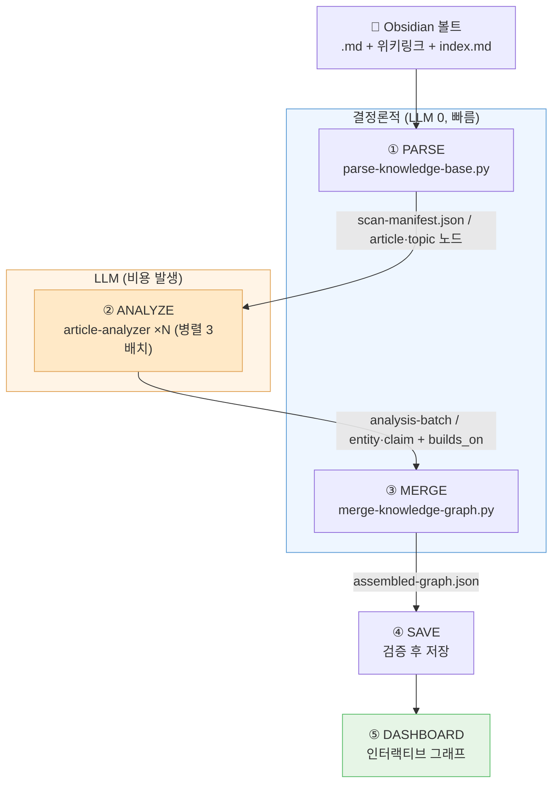
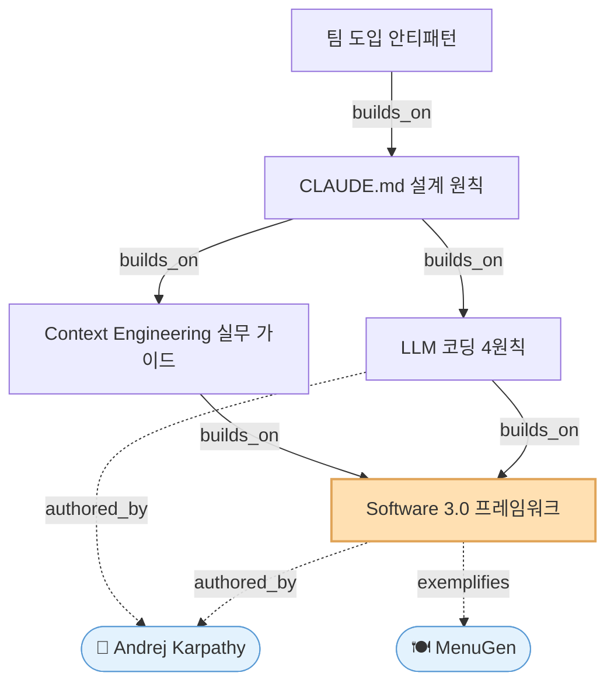
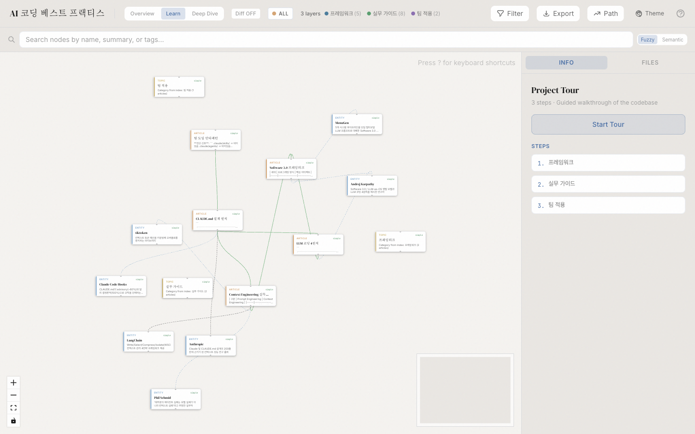
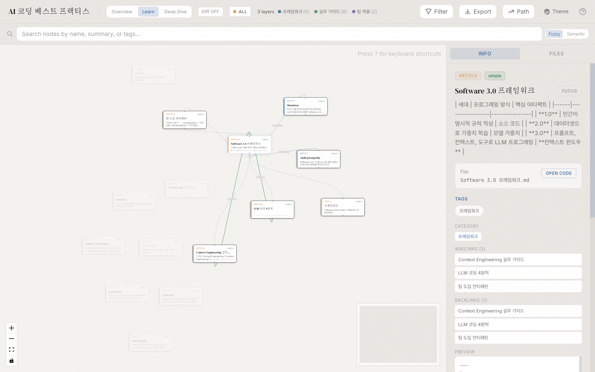

[지난 글](/understand-anything)에서 **Understand-Anything**으로 코드베이스를 지식 그래프로 시각화하는 방법을 다뤘다. 그런데 이 도구에는 코드 분석 말고도 숨은 기능이 하나 더 있다. 바로 `/understand-knowledge`다.

이 명령어는 **마크다운 위키(지식 베이스)를 분석**한다. 그리고 그 감지 조건이 사실상 **Obsidian 볼트 구조와 동일**하다. 즉, 내가 몇 년간 쌓아온 Obsidian 노트를 그대로 지식 그래프로 만들 수 있다는 뜻이다.

## Obsidian 그래프 뷰의 한계

Obsidian에는 이미 그래프 뷰가 있다. 노트들이 점으로 표시되고 `[[링크]]`로 연결된다. 처음 보면 멋있다. 그런데 노트가 수백 개 쌓이면 이렇게 된다.

- 점이 너무 많아 <strong>그냥 털뭉치(hairball)</strong>가 된다
- 노드를 클릭해도 보이는 건 **파일명뿐**
- 명시적으로 `[[링크]]`를 건 연결만 보인다 — 내용상 관련 있지만 링크를 안 단 노트는 따로 논다
- "이 주제 노트들이 실제로 어떤 흐름으로 연결되는가"는 알 수 없다

결국 그래프 뷰는 "예쁜 시각화"에 머무는 경우가 많다. 정작 **내 지식이 어떻게 연결돼 있는지 가르쳐주지는 못한다.**

## Understand-Anything이 다른 점

`/understand-knowledge`는 [Karpathy의 LLM 위키 패턴](https://gist.github.com/karpathy/442a6bf555914893e9891c11519de94f)을 분석하도록 만들어졌다. 핵심은 **단순 링크 시각화가 아니라 LLM이 노트 내용을 읽고 관계를 추론**한다는 점이다.

| | Obsidian 그래프 뷰 | Understand-Anything |
|---|---|---|
| 연결 기준 | 명시적 `[[링크]]`만 | 링크 **+ LLM이 찾은 암묵적 관계** |
| 노드 정보 | 파일명 | 요약·핵심 엔티티·주장(claim)·복잡도 |
| 탐색 방식 | 시각적 점들 | 가이드 투어 + 의미 기반 검색 + 채팅 질의 |
| 그룹핑 | 색상 그룹 | `index.md` 카테고리 기반 자동 레이어링 |

쉽게 말해, Obsidian 그래프 뷰가 "누가 누구랑 선으로 이어졌나"를 보여준다면, Understand-Anything은 "이 노트들이 **무슨 이야기를 하고 어떻게 맞물리는가**"를 보여준다.

## 어떻게 동작하는가

플러그인의 감지 로직을 직접 뜯어봤다. `parse-knowledge-base.py`의 핵심은 이렇다.

```python
# index.md가 있고 + 마크다운 파일이 3개 이상이면 위키로 인식
if signals["has_index"] and signals["md_count"] >= 3:
    signals["detected"] = True
    signals["format"] = "karpathy"
```

조건이 생각보다 단순하다.

- ✅ `index.md` 파일이 존재하고
- ✅ `.md` 파일이 3개 이상이며
- ✅ `[[wikilink]]` 문법을 사용한다 → **이게 정확히 Obsidian 위키링크**

대부분의 Obsidian 볼트는 이미 2·3번 조건을 만족한다. **`index.md`(일종의 MOC, Map of Content) 하나만 만들어주면** 곧바로 분석 대상이 된다.

전체 파이프라인은 5단계다.

1. **DETECT / SCAN** — 결정론적 파서가 `[[wikilink]]`, 헤딩, frontmatter, `index.md`의 카테고리(`##` 섹션)를 추출
2. **ANALYZE** — `article-analyzer` 서브에이전트가 노트를 10~15개씩 배치로 읽으며 *암묵적* 관계·엔티티·주장을 발굴 (최대 3배치 동시 실행)
3. **MERGE** — 엔티티 중복 제거, 카테고리 기반 레이어 구성, `index.md` 순서대로 가이드 투어 생성
4. **SAVE** — `.understand-anything/knowledge-graph.json`으로 저장
5. **DASHBOARD** — `/understand-dashboard`로 force-directed 그래프 + 커뮤니티 클러스터링 + 의미 검색 제공

흐름으로 그리면 이렇다. **결정론적 파서**가 뼈대를 만들고, **LLM**이 살을 붙이는 구조다.



> **핵심**: ①③은 **공짜이고 빠른** 결정론적 단계, ②만 **LLM 비용**이 드는 단계다. 그래서 노트 양이 많아질수록 ②를 주제 폴더 단위로 쪼개는 게 비용·품질 모두 유리하다.

## 직접 해보기

### 1. 플러그인 설치

```bash
/plugin marketplace add Lum1104/Understand-Anything
/plugin install understand-anything
```

### 2. 볼트 폴더에 `index.md` 만들기

볼트 전체보다 **특정 주제 폴더 단위**로 돌리는 게 분석 품질이 좋다. 같은 배치 안에서 노트끼리 상호 참조를 찾기 때문이다.

내가 실제로 분석한 폴더 구조는 이랬다. **`index.md` 하나 + 서로 `[[링크]]`로 엮인 노트들**, 이게 전부다.

```
AI/Best-Practices/
├── index.md                       ← MOC (카테고리 정의, 必)
├── Software 3.0 프레임워크.md       ┐
├── LLM 코딩 4원칙.md                │  서로 [[wikilink]]로
├── Context Engineering 실무 가이드.md │  연결된 노트들
├── CLAUDE.md 설계 원칙.md           │
└── 팀 도입 안티패턴.md              ┘

# 분석 후 자동 생성
└── .understand-anything/
    ├── knowledge-graph.json        ← 최종 그래프 데이터
    └── meta.json                   ← 분석 메타데이터
```

`index.md`는 이렇게 `##` 섹션으로 카테고리를 나눠 쓴다. **이 섹션이 그대로 그래프의 레이어**가 된다.

```markdown
# AI 코딩 베스트 프랙티스

## 프레임워크
- [[Software 3.0 프레임워크]]
- [[LLM 코딩 4원칙]]

## 실무 가이드
- [[Context Engineering 실무 가이드]]
- [[CLAUDE.md 설계 원칙]]

## 팀 적용
- [[팀 도입 안티패턴]]
```

> **Obsidian 사용자라면 거의 다 됐다.** 이미 `[[링크]]`로 노트를 엮고 있다면, 주제 폴더에 **`index.md` 한 장만 추가**하면 끝이다. 새 문법을 배울 필요가 없다.

### 3. 분석 실행

```bash
/understand-knowledge "30.areas/backend"
```

### 4. 대시보드 열기

```bash
/understand-dashboard
```

내 노트가 색상별 레이어로 묶인 그래프로 나타난다. 노드를 클릭하면 요약과 관련 노트, 그리고 LLM이 찾아낸 연결 이유가 표시된다.

## 실제로 적용해본 결과

내 볼트의 `AI/Best-Practices` 폴더(LLM 코딩 원칙 노트 5개)로 직접 검증해봤다. 플러그인의 감지 파서를 그대로 돌린 결과다.

**먼저 `index.md` 없이 실행**하면 이렇게 거절당한다.

```json
{"error": "Not a Karpathy-pattern wiki",
 "detection": {"has_index": false, "md_count": 5, "detected": false}}
```

노트 5개가 서로 `[[링크]]`로 연결돼 있어도, **`index.md`가 없으면 인식 자체를 안 한다.** 그래서 아래와 같은 MOC를 만들었다.

```markdown
# AI 코딩 베스트 프랙티스

## 프레임워크
- [[Software 3.0 프레임워크]]
- [[LLM 코딩 4원칙]]

## 실무 가이드
- [[Context Engineering 실무 가이드]]
- [[CLAUDE.md 설계 원칙]]

## 팀 적용
- [[팀 도입 안티패턴]]
```

**다시 실행하니 곧바로 인식**됐다.

```
[parse] Karpathy wiki: 5 articles, 0 sources, 3 topics, 15 wikilinks (0 unresolved)
```

결정론적 스캔만으로 나온 1차 구조는 이렇다.

| 항목 | 결과 |
|---|---|
| 노드 | 8개 (노트 5 + 토픽 3) |
| 엣지 | 20개 (위키링크 15 + 카테고리 5) |
| 토픽(레이어) | `프레임워크`, `실무 가이드`, `팀 적용` |
| 미해결 링크 | 0개 |

주목할 점은 **토픽(레이어)이 내가 `index.md`에 적은 `##` 섹션 그대로** 잡혔다는 것이다. MOC를 정성껏 쓸수록 그래프의 분류 품질이 좋아진다.

### LLM 분석 단계 — 여기서 진짜 차이가 난다

핵심은 그다음이다. `article-analyzer`가 5개 노트의 **본문을 읽고**, 위키링크에 없던 **암묵적 관계**를 뽑아냈다. 최종 그래프는 이렇게 불어났다.

| 항목 | 스캔만 | LLM 분석 후 |
|---|---|---|
| 노드 | 8개 | **15개** (+엔티티 7) |
| 엣지 | 20개 | **33개** (+암묵 관계 13) |

추가된 엔티티는 노트에 **위키링크 페이지로 존재하지 않지만 본문에 등장한 핵심 개념**들이다 — `Andrej Karpathy`, `Phil Schmid`, `Anthropic`, `LangChain`, `Claude Code Hooks`, `tiktoken`, `MenuGen`. 그리고 LLM이 찾아낸 관계의 종류가 흥미롭다.

- **`builds_on` 5개** — 예: "CLAUDE.md 설계 원칙"이 "LLM 코딩 4원칙"을 *실제 파일 구조로 발전시킴*. 단순 `[[링크]]`로는 안 보이던 **방향성 있는 발전 관계**다.
- **`authored_by` 3개** — Software 3.0과 4원칙이 모두 *Karpathy*에게 귀속됨을 추론
- **`exemplifies` 3개** — MenuGen이 "소프트웨어 소멸" 논지의 *구체 사례*임을 연결
- **`cites` 2개** — CLAUDE.md 200줄 한계의 근거로 *Anthropic 연구*를 인용했음을 포착

Obsidian 그래프 뷰였다면 5개 노트가 그냥 서로 연결된 점 5개로만 보였을 것이다. 반면 여기서는 "이 노트들이 **Karpathy의 Software 3.0이라는 뿌리에서 출발해, 4원칙 → CLAUDE.md 설계 → 팀 거버넌스로 점점 구체화되는 한 줄기의 사고 흐름**"이라는 게 드러난다. LLM이 찾아낸 `builds_on` 관계만 추려 그리면 이렇다.



화살표가 **추상 → 구체** 방향(Software 3.0 → 4원칙 → CLAUDE.md → 팀 거버넌스)을 그대로 가리킨다. 단순 양방향 `[[링크]]`로는 절대 안 보이는, **지식의 위계와 발전 순서**다.

### 대시보드로 본 결과

실제로 `/understand-dashboard`로 띄운 화면이다. 노트(파란 카드)·토픽·엔티티가 한 그래프 안에서 색상별로 묶이고, 카테고리는 자동 레이어로 정렬된다.



노드를 클릭하면 우측에 **요약과 관계 목록**이 펼쳐진다. "Software 3.0 프레임워크" 노드를 누르니, LLM이 찾아낸 연결(Context Engineering·LLM 코딩 4원칙으로의 발전, MenuGen 사례, Karpathy 귀속)이 한눈에 보인다.



## 어떤 사람에게 유용한가

- **세컨드 브레인을 운영하는 사람** — 노트가 쌓일수록 전체 구조가 안 보일 때, 흩어진 지식의 큰 그림을 다시 그릴 수 있다
- **학습 노트를 정리하는 사람** — 특정 주제 폴더를 분석해 "내가 이 분야를 얼마나, 어떻게 이해하고 있는가"를 객관적으로 점검
- **글쓰기 소재를 찾는 사람** — LLM이 찾은 암묵적 연결에서 미처 몰랐던 노트 간 접점을 발견

## 한계와 주의점

솔직하게 짚자면 이런 점은 감안해야 한다.

- 결과물은 **Obsidian 내부가 아니라 별도 웹 대시보드**다. 볼트에는 `.understand-anything/` 폴더에 JSON만 생긴다
- `index.md`가 **필수**다. 폴더 구조만 쓰는 볼트라면 MOC 성격의 파일을 따로 만들어야 한다
- LLM 분석 단계가 있어 노트 수에 비례해 **API 토큰·시간 비용**이 든다
- 볼트 전체를 한 번에 돌리기보다 **주제 폴더 단위**로 쪼개는 편이 품질·비용 모두 낫다

## 마무리

Obsidian의 그래프 뷰가 "내 노트가 얼마나 복잡한지"를 보여준다면, Understand-Anything은 "내 노트가 **어떻게 연결돼 하나의 지식이 되는지**"를 보여준다. 코드베이스뿐 아니라 **내 머릿속(을 옮겨놓은 볼트)** 도 지식 그래프로 만들 수 있다는 점이 이 도구의 진짜 매력이다.

세컨드 브레인을 진지하게 운영하고 있다면, 주제 폴더 하나에 `index.md`를 만들고 `/understand-knowledge`를 한 번 돌려보길 권한다.

- 저장소: [Lum1104/Understand-Anything](https://github.com/Lum1104/Understand-Anything)
- 라이브 데모: [understand-anything.com/demo](https://understand-anything.com/demo/)

```toc
```
