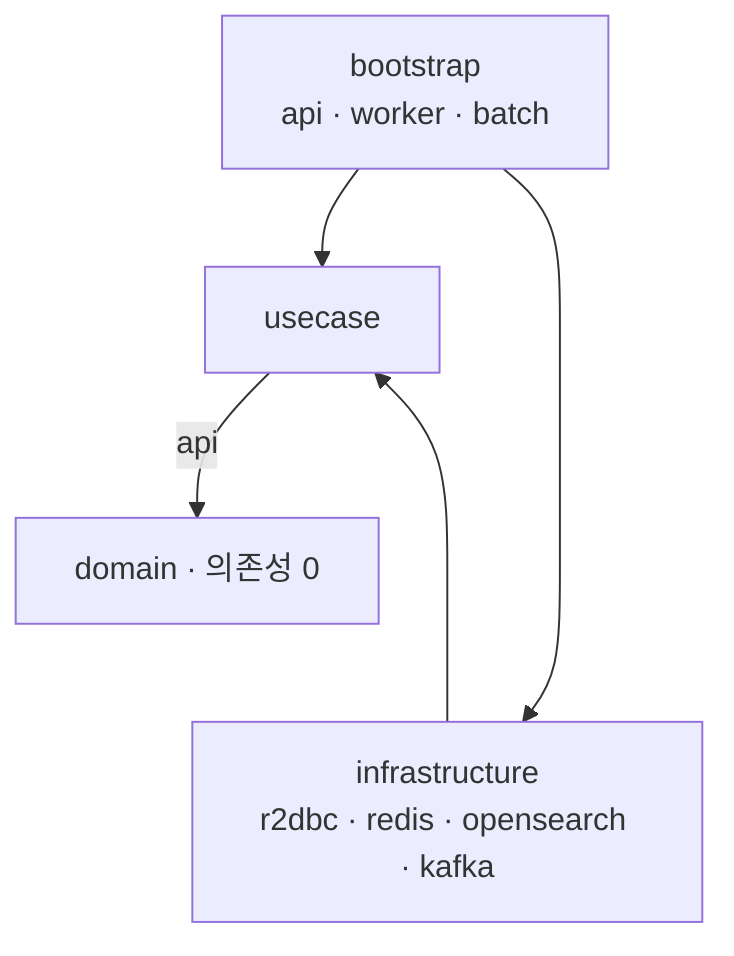
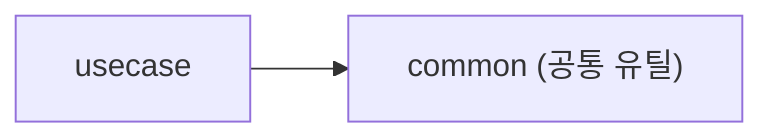

> 이미 알고 있는 것을 손으로 다시 짜는 재활. 3일차는 빌드 컨벤션 + 의존성 방향 + ArchUnit.

## PR

- [chore: root build convention, archunit 구조](https://github.com/smk692/wms/pull/3)

## 오늘 한 것

- 루트 `build.gradle.kts` 공통 컨벤션: JDK 21 toolchain, `-Xjsr305=strict`, JUnit Platform
- Spring Boot BOM 을 platform 으로 전 모듈에 적용
- 모듈 의존성을 헥사고날 방향으로 연결
- kotlin-spring(r2dbc/redis/kafka), spring-boot(bootstrap 3종) 플러그인 배치
- ArchUnit 으로 의존 방향을 각 모듈 test 에 강제

## allprojects vs subprojects

| 블록 | 적용 대상 |
|---|---|
| `allprojects` | 루트 + 모든 서브 (group/version/repo) |
| `subprojects` | 서브만 (kotlin 플러그인, toolchain) |

루트는 코드 없는 묶음 프로젝트라, 컴파일 설정은 `subprojects` 에만 둔다.

## api vs implementation

| | 전파 | 용도 |
|---|---|---|
| `api(X)` | 나를 쓰는 쪽도 X 를 봄 | usecase -> domain (타입 노출) |
| `implementation(X)` | X 를 숨김 | bootstrap -> infra (구현 은닉) |

의존성 노출 경계가 곧 헥사고날 경계다.

## 의존성 방향

핵심 의존 체인은 `bootstrap -> usecase -> domain` 이다. infrastructure 는 usecase 의 Port 를 구현하고(바깥에서 안쪽으로), bootstrap 이 그 어댑터를 조립한다.



모든 화살표가 안쪽(domain)을 향한다. domain 은 프레임워크도 바깥 레이어도 모른다.

common 은 어느 레이어든 가져다 쓰는 최하위 공통 유틸이라 별도로 둔다. 어떤 레이어도 참조하지 않고 의존을 받기만 한다. 지금은 usecase 가 공통 예외 베이스(`WmsException`)를 사용한다.



### 모듈별 의존

| 모듈 | 의존 | 비고 |
|---|---|---|
| common | 없음 | 최하위 공통 유틸 (의존을 받기만) |
| domain | 없음 | 순수 코어, 의존성 0 |
| usecase | `api(domain)` + `common` | domain 타입 노출 + 공통 유틸 사용 |
| infra/r2dbc·redis·opensearch·kafka | `usecase` | out-Port 구현 |
| bootstrap/api | usecase + r2dbc + redis + opensearch | 웹 진입 |
| bootstrap/worker | usecase + r2dbc + redis + kafka | 컨슈머·스케줄 |
| bootstrap/batch | usecase + r2dbc | 대용량 잡 |

### bootstrap 별 조립 차이

```
api    -> r2dbc · redis · opensearch   (웹: 저장 + 캐시/락 + 검색)
worker -> r2dbc · redis · kafka        (이벤트 컨슈머 + 락 + 저장)
batch  -> r2dbc                        (대용량 저장만)
```

각 부트스트랩이 자신에게 필요한 어댑터만 골라 조립한다. api 는 검색(opensearch)을 쓰지만 kafka 는 쓰지 않고, worker 는 반대다.

## ArchUnit — 빌드 방어선 vs 테스트 방어선

| 위반 | 누가 막나 |
|---|---|
| domain -> bootstrap | Gradle (순환 의존 에러) |
| usecase -> infra | 컴파일러 (클래스패스에 없음) |
| api -> worker (bootstrap 끼리) | ArchUnit 만 |

핵심: `api -> worker` 는 worker 가 api 를 의존하지 않으므로 순환이 아니다. 그래서 빌드가 통과시킨다. 부트스트랩끼리 참조 금지는 ArchUnit 이 유일한 방어선이다.

실제로 api 코드에서 worker 를 참조하게 만들었더니, Gradle 은 통과시키고 `ApiArchTest` 가 실패로 잡아냈다.

### 설정 — 각 모듈 test 에 분산 (전용 모듈을 두지 않은 이유)

이미 Gradle 모듈 경계로 레이어가 나뉘어 있다. 그래서 전용 archtest 모듈을 따로 두지 않고, 각 모듈 test 에 규칙을 남겼다. 모듈 경계가 1차로 막아주는 위에, ArchUnit 으로 "역방향 의존을 하지 않는다"와 "아키텍처 의도대로 개발한다"를 각 모듈에 명시적으로 박아두려는 것이다. 의도를 코드로 문서화하고, 미래에 의존이 잘못 추가돼도 회귀를 잡는다.

ArchUnit 은 테스트가 도는 모듈의 클래스패스만 보므로(공식 이슈 #487 한계), 각 모듈은 자기 기준으로 "나는 금지된 패키지를 의존하지 않는다"를 검증한다. `archunit-junit5` 는 루트 `subprojects` 의 공통 testImplementation 으로 전 모듈에 제공했다.

| 모듈 test | 규칙 |
|---|---|
| CommonArchTest | 어떤 레이어도 참조 0 (최하위 유틸) |
| DomainArchTest | 프레임워크 + 바깥 레이어 참조 0 |
| UseCaseArchTest | 인프라 · bootstrap · spring 참조 0 |
| R2dbc · Redis · OpenSearch · KafkaArchTest | bootstrap 참조 0 |
| Api · Worker · BatchArchTest | 다른 bootstrap 참조 0 |

```kotlin
@AnalyzeClasses(
    packages = ["com.mingi.wms.api"],
    importOptions = [ImportOption.DoNotIncludeTests::class],
)
class ApiArchTest {

    @ArchTest
    val apiDoesNotDependOnOtherBootstraps: ArchRule = noClasses()
        .that().resideInAPackage("com.mingi.wms.api..")
        .should().dependOnClassesThat().resideInAnyPackage(
            "com.mingi.wms.worker..",
            "com.mingi.wms.batch..",
        )
        .because("부트스트랩은 독립 실행 단위 — 서로 참조하지 않는다")
        .allowEmptyShould(true) // 아직 클래스 없는 모듈에서도 통과
}
```

`allowEmptyShould(true)` 는 usecase/infra 에 아직 클래스가 거의 없어 규칙이 빈 검사로 통과하기 위함이다. C1 부터 코드가 쌓이면 실제로 위반을 잡기 시작한다.

## 다음에 추가할 것

- 모듈 내부 규칙(네이밍/패키지 위치)은 C1 부터 각 모듈 test 에 추가

## 고민 내용

> "빌드가 못 막는 부트스트랩 간 참조까지 ArchUnit으로 차단해, 아키텍처 위반을 컴파일·테스트 단계에서 잡도록 함"
